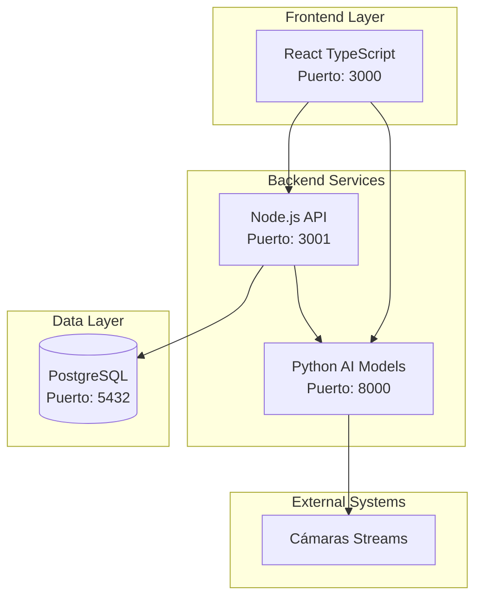

# 🅿️ Smart Parking System - Universidad

Sistema integral de gestión de estacionamiento universitario con arquitectura de microservicios, inteligencia artificial y monitoreo en tiempo real.

## 🏗️ Arquitectura del Sistema

Este proyecto implementa una arquitectura de microservicios distribuidos, donde cada servicio tiene una responsabilidad específica y puede escalarse independientemente:



## 🚀 Servicios del Sistema

### 🌐 Frontend (React + TypeScript)
- **Puerto**: 3000
- **Tecnología**: React 18, TypeScript, React Router
- **Funcionalidad**: Panel administrativo, sistema de reservas, monitoreo de cámaras
- **Contenedor**: Docker con desarrollo en vivo

### 🔧 Backend API (Node.js + Express)
- **Puerto**: 3001  
- **Tecnología**: Node.js, TypeScript, Express, JWT
- **Funcionalidad**: API REST, autenticación, gestión de datos, lógica de negocio
- **Contenedor**: Docker con PostgreSQL

### 🤖 Python Models (FastAPI + IA)
- **Puerto**: 8000
- **Tecnología**: FastAPI, OpenCV, YOLO, EasyOCR, PyTorch  
- **Funcionalidad**: Detección de vehículos, reconocimiento de patentes, análisis IA
- **Contenedor**: Docker 

### 🗄️ Database (PostgreSQL)
- **Puerto**: 5432
- **Tecnología**: PostgreSQL 15
- **Funcionalidad**: Almacenamiento principal, reservas
- **Contenedor**: Docker con scripts de inicialización


## 🎯 Funcionalidades Principales

### Para usuarios
- ✅ **Reserva de Espacios**: Sistema de reservas con fecha y hora
- ✅ **Notificaciones al correo**: Alertas de reservas, vencimientos y disponibilidad

### Para Administradores  
- ✅ **Dashboard Completo**: Vista general del sistema y ocupación
- ✅ **Configuración de Espacios**: Zonas, espacios y tipos especiales
- ✅ **Reportes Avanzados**: Analytics, métricas y exportación de datos

### Inteligencia Artificial
- ✅ **Detección de Vehículos**: Identificación automática con YOLO v8
- ✅ **Reconocimiento de Patentes**: OCR especializado para patentes chilenas
- ✅ **Análisis de Ocupación**: Determinación automática de espacios libres/ocupados
- ✅ **Tracking de Vehículos**: Seguimiento de movimientos en tiempo real
- ✅ **Alertas Inteligentes**: Notificaciones basadas en patrones detectados

## 🛠️ Configuración e Instalación

### Prerrequisitos
- **Docker** y **Docker Compose** 
- **Node.js 18+** (para desarrollo local)
- **Python 3.11+** (para desarrollo de IA)
- **PostgreSQL** (para desarrollo local)

### 🚀 Instalación Rápida con Docker

1. **Clonar el repositorio:**
```bash
git clone https://github.com/CristobalSg/SmartParkingTwo.git
cd SmartParkingTwo
```

2. **Configurar variables de entorno:**
```bash
cp .env.example .env
# Editar .env con configuraciones específicas
```

3. **Levantar todos los servicios:**
```bash
docker-compose up -d
```

4. **Verificar que todos los servicios estén ejecutándose:**
```bash
docker-compose ps
```

### 🌐 Acceso a los Servicios

Una vez que todos los contenedores estén ejecutándose:

- **Frontend**: http://localhost:3000
- **Backend API**: http://localhost:3001/api
- **Python AI API**: http://localhost:8000/
- **Base de Datos**: localhost:5432

### 🔧 Desarrollo Local

Cada servicio puede ejecutarse independientemente para desarrollo:

```bash
# Frontend
cd frontend
npm install
npm start

# Backend  
cd backend
npm install
npm run dev

# Python Models
cd python-models
pip install -r requirements.txt
uvicorn app.main:app --reload

# Database
docker-compose up database -d
```

## 📁 Estructura del Proyecto

```
SmartParkingTwo/
├── frontend/                    # React TypeScript App
│   ├── src/
│   │   ├── components/         # Componentes React reutilizables
│   │   ├── pages/             # Páginas principales de la aplicación  
│   │   ├── services/          # Servicios API y utilidades
│   │   └── types/             # Tipos TypeScript
│   ├── package.json
│   ├── tsconfig.json
│   └── Dockerfile
│
├── backend/                     # Node.js Express API
│   ├── src/
│   │   ├── controllers/       # Controladores de rutas
│   │   ├── routes/           # Definición de endpoints
│   │   ├── services/         # Lógica de negocio
│   │   ├── middleware/       # Middlewares de Express
│   │   ├── models/           # Modelos de datos
│   │   └── types/           # Tipos TypeScript
│   ├── package.json
│   ├── tsconfig.json  
│   └── Dockerfile
│
├── python-models/              # FastAPI + AI Models
│   ├── app/
│   │   ├── api/              # Endpoints FastAPI
│   │   ├── models/           # Modelos de IA (YOLO, OCR)
│   │   ├── services/         # Servicios de procesamiento
│   │   └── core/             # Configuración y utilidades
│   ├── tests/                # Pruebas de los modelos
│   ├── requirements.txt
│   └── Dockerfile
│
├── database/                   # PostgreSQL Database
│   ├── init/                 # Scripts de inicialización
│   ├── seeds/                # Datos de prueba
│   ├── migrations/           # Migraciones de esquema
│   └── Dockerfile
│
├── docker-compose.yml          # Orquestación de servicios
├── .env.example               # Variables de entorno de ejemplo
├── .gitignore                # Archivos ignorados por Git
└── README.md                 # Esta documentación
```

## 🔐 Variables de Entorno

Crear archivo `.env` en la raíz con estas configuraciones:

```env
# Database
POSTGRES_DB=smart_parking
POSTGRES_USER=postgres  
POSTGRES_PASSWORD=parking123

# Backend API
NODE_ENV=development
JWT_SECRET=your-super-secret-jwt-key
API_PORT=3001

# Python Models
MODEL_PATH=/app/models/model.pt
AI_API_PORT=8000


# Frontend  
REACT_APP_API_URL=http://localhost:3001/api
REACT_APP_AI_API_URL=http://localhost:8000/api
```

## 🧪 Testing y Quality Assurance

### Pruebas Automatizadas
```bash
# Frontend Tests
cd frontend && npm test

# Backend Tests  
cd backend && npm test

# AI Models Tests
cd python-models && pytest

# Integration Tests
docker-compose -f docker-compose.test.yml up
```

### Code Quality
```bash
# Linting y Formateo
npm run lint        # Frontend & Backend
black .             # Python formatting  
isort .             # Python imports

# Type Checking
npm run type-check  # TypeScript
mypy app/           # Python types
```

## 📊 Monitoreo y Observabilidad

### Health Checks
- **Frontend**: http://localhost:3000/health
- **Backend**: http://localhost:3001/api/health  
- **AI Models**: http://localhost:8000/health
- **Database**: Verificación automática via Docker

### Logs y Métricas
```bash
# Ver logs de todos los servicios
docker-compose logs -f

# Logs específicos por servicio
docker-compose logs -f backend
docker-compose logs -f python-models

# Métricas de uso
docker stats
```

## 🚀 Deployment y Producción

### Preparación para Producción
1. **Configurar variables de entorno de producción**
2. **Optimizar imágenes Docker**
3. **Configurar certificados SSL**
4. **Implementar backup de base de datos**
5. **Configurar monitoreo avanzado**

### Docker Compose Producción
```bash
docker-compose -f docker-compose.yml -f docker-compose.prod.yml up -d
```

### Kubernetes (Futuro)
- Manifiestos incluidos en `/k8s/`
- Helm charts para deployment
- Auto-scaling por demanda

## 🔒 Seguridad

### Medidas Implementadas
- ✅ **JWT Authentication**: Tokens seguros para API
- ✅ **Input Validation**: Validación de datos de entrada
- ✅ **SQL Injection Prevention**: Queries parametrizadas
- ✅ **CORS Configuration**: Control de acceso cross-origin
- ✅ **Environment Variables**: Secrets fuera del código


## 🤝 Contribución y Desarrollo

### Workflow de Desarrollo
1. **Fork del repositorio**
2. **Crear rama feature**: `git checkout -b feature/nueva-funcionalidad`
3. **Commits descriptivos**: `git commit -m "feat: agregar detección nocturna"`
4. **Pull Request** con descripción detallada
5. **Code Review** por el equipo
6. **Merge** después de aprobación

### Estándares de Código
- **Frontend**: ESLint + Prettier
- **Backend**: ESLint + Prettier  
- **Commits**: Conventional Commits

## 📚 Documentación Adicional

Cada servicio contiene documentación específica en su directorio:

- [Frontend Documentation](./frontend/README.md)
- [Backend API Documentation](./backend/README.md)  
- [AI Models Documentation](./python-models/README.md)
- [Database Schema Documentation](./database/README.md)

### API Documentation
- **Backend API**: http://localhost:3001/api/docs
- **AI Models API**: http://localhost:8000/docs

## 📄 Licencia

Este proyecto está licenciado bajo la [MIT License](LICENSE).

---

**Desarrollado con ❤️ para la comunidad universitaria**
